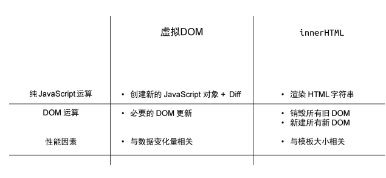
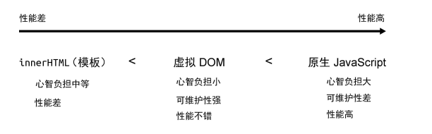

# 命令式框架 vs 声明式框架
## 两种框架怎么实现下面这段话
 - 获取 id 为 app 的 div 标签
 - 它的文本内容为 hello world
 - 为其绑定点击事件
 - 当点击时弹出提示：ok
> ### 命令式： 最大的特点就是<font color='red'>**关注过程**</font>
>> ### jQuery
```js
        $('#app') // 获取 div
          .text('hello world') // 设置文本内容
          .on('click', () => { alert('ok') }) // 绑定点击事件
```
>> ### JavaScript
```js
        const div = document.querySelector('#app') // 获取 div
        div.innerText = 'hello world' // 设置文本内容
        div.addEventListener('click', () => { alert('ok') }) // 绑定点击事
```
> ### 声明式： 最大的特点就是<font color='red'>**关注结果**</font>
```js
        <div @click="() => alert('ok')">hello world</div>
```
- > Vue.js 帮我们封装了**过程**。因此，我们能够猜到 Vue.js 的内部实现一定是**命令式**的，而暴露给用户的却更加**声明式**

## 直接修改的性能消耗为A, 找出差异的性能消耗为B
## 命令式 代码的更新性能消耗 = A + B， 声明式代码的性能消耗 = A
<p align="center">
  <!-- <a target="_blank" href="./更新性能.png"> -->
    
  <!-- </a> -->
</p>
<p align="center">
  <!-- <a target="_blank" href="./更新性能.png"> -->
    
  <!-- </a> -->
</p>


### 虚拟 DOM 的性能怎样？

[尤大讲解虚拟 DOM 的本质，虚拟 DOM 一定比真实 DOM 更快吗？](https://www.zhihu.com/question/31809713/answer/53544875)

1. 虚拟 DOM 的表现：是用 JS 对象描述 DOM 节点。

2. 虚拟 DOM 的出现：是为了减少最小化的更新差异。

3. 虚拟 DOM 可以作为一个中间角色：可以渲染到其他端(跨端)。DOM => 虚拟 DOM => 目标端。
4. 我们了解到编译器和渲染器之间是存在信息交流的，它们互相配合使得性能进一步提升，而它们之间交流的媒介就是虚拟 DOM 对象。在后面的学习中，我们会看到一个虚拟 DOM 对象中会包含多种数据字段，每个字段都代表一定的含义